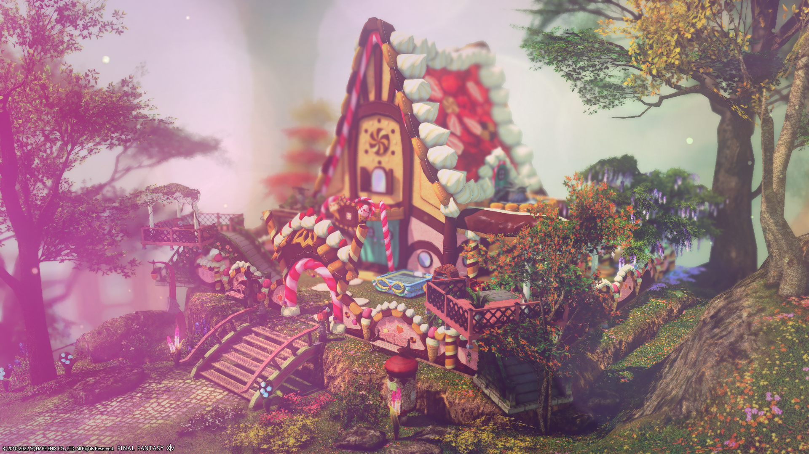

# Projeto-Mooncakery

<h1 align="center">
    
    
🚧Padoca da Moon em construção!🚧

</h1>

<h2>🔗 link da página</h2>

<a href="http://mooncakery.com.br/index.html">http://mooncakery.com.br</a>

<h2>Indice</h2>

- [Repositório](#-Sobre-o-repositório)
- [Game](#-Sobre-o-jogo)
- [Free Company](#-Sobre-a-FC)
- [Ferramentas](#-Ferramentas-utilizadas)
- [Contribuir](#-Como-contribuir?)

<h2>💻 Demonstração</h2>

<h2>📚 Sobre o repositório</h2>

O **Projeto Mooncakery** surgiu com o intuito de criar um website para a FC brasileira chamada Bolinho, além do site ser um novo canal de contato para um público que não está tão familiarizado com a FC, pretendemos gerar conteúdos próprios comos notícias e guias, focados em ajudar tanto novos como atuais jogadores de Final Fantasy XIV, ou seja um lugar confortável onde podemos curtir e repassar nosso amor e conhecimento pelo game ♥

<h2>🎮 Sobre o jogo</h2>

Lorem ipsum dolor sit amet, consectetur adipiscing elit, sed do eiusmod tempor incididunt ut labore et dolore magna aliqua. Id consectetur purus ut faucibus pulvinar elementum integer. Nunc sed id semper risus in hendrerit gravida rutrum quisque. At tempor commodo ullamcorper a lacus vestibulum.

<h2>🏠 Sobre a FC</h2>

Lorem ipsum dolor sit amet, consectetur adipiscing elit, sed do eiusmod tempor incididunt ut labore et dolore magna aliqua. Id consectetur purus ut faucibus pulvinar elementum integer. Nunc sed id semper risus in hendrerit gravida rutrum quisque.

<h2>🔨 Ferramentas utilizadas</h2>

- [HTML](https://www.learn-html.org)
- [CSS](https://developer.mozilla.org/pt-BR/docs/Web/CSS)

<h2>🚀Como contribuir?</h2>

Toda ajuda é bem vinda para erguermos a padoca da Moon 🧁 (OBSS: Não pensei direito no que botar aqui ainda)

